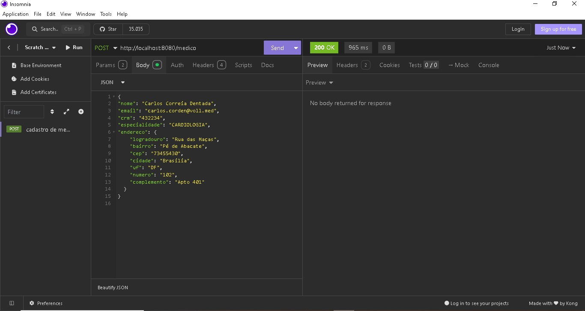

# Clinica_Medica
API REST com persistência de dados:
- Spring boot data jpa(Hibernate).
- Banco de dados postgreSQL. 
- Insomnia para fazer requisições à API.  
    
 ## Cadastrar | Listar | Paginar | Atualizar | Apagar  

<video controls width="300">
  <source src="/api/arquivos-do-projeto/cadastrar-listar-paginar-atualizar-apagar.webm" type="video/webm" />

  <source src="/api/arquivos-do-projeto/apagar-recuperar.webm" type="video/webm" />
 
</video>   

<video controls width="300">

  <source src="/api/arquivos-do-projeto/apagar-recuperar.webm" type="video/webm" />
 
</video> 

    
  <!--   >       
          
      -->

      

     
      
    

